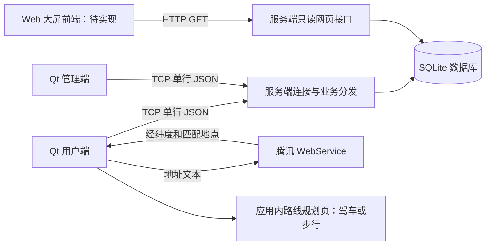
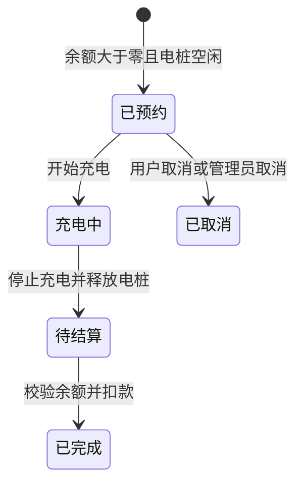

# 答辩代码导读

本导读按当前源码整理，供答辩前阅读与现场定位。函数链接指向当前代码行；后续代码改动后可用函数名搜索。源代码中的英文标识符用于定位，说明文字使用中文。

## 1. 先讲清楚整体结构

系统分为用户端、管理端、服务端、Web 数据展示和文档五个模块。当前仓库有三个可编译程序：`client`、`AdminClient`、`server`。`web/` 前端尚未实现，不能在答辩中表述为大屏已完成；服务端已经提供供其读取的接口。`tools/` 仅放站点导入数据。

核心边界：两个 Qt 端不访问数据库、不互相通信；数据库写操作由服务端负责。腾讯地图网络请求由用户端直接发出，不经过充电业务服务端。

推荐阅读顺序：各端入口 → 用户端登录 → 两端通信类 → 服务端连接与消息表 → 充电订单状态机 → 管理端站点电桩页 → 地图 → 公共组件。

## 2. 用户端：从界面功能找到代码

| 功能 | 主要代码与入口 | 请求或执行逻辑 |
|---|---|---|
| 登录与自动注册 | [client/src/pages/loginpage.cpp](../client/src/pages/loginpage.cpp#L1) / [`LoginPage::doLogin`](../client/src/pages/loginpage.cpp#L240) | user_login；密码或验证码二选一，手机号未注册时由服务端创建账号。 |
| 获取验证码 | [client/src/ui/smscodebutton.cpp](../client/src/ui/smscodebutton.cpp#L1) / [`SmsCodeButton::sendRequest`](../client/src/ui/smscodebutton.cpp#L79) | user_code_request；这是课程模拟短信，验证码由接口返回并弹窗显示。 |
| 忘记密码 | [client/src/pages/resetpassworddialog.cpp](../client/src/pages/resetpassworddialog.cpp#L1) / [`ResetPasswordDialog::onReset`](../client/src/pages/resetpassworddialog.cpp#L89) | user_password_reset；验证码校验后更新密码。 |
| 首次设置与修改密码 | [client/src/pages/passworddialog.cpp](../client/src/pages/passworddialog.cpp#L1) / [`PasswordDialog::onSubmit`](../client/src/pages/passworddialog.cpp#L73) | user_password_update；首次设置可以没有原密码。 |
| 区域、地址和手动定位 | [client/src/pages/findstationpage.cpp](../client/src/pages/findstationpage.cpp#L1) / [`FindStationPage::onGeocodeClicked`](../client/src/pages/findstationpage.cpp#L235) | 区域为预设坐标，地址通过腾讯解析，手动输入直接采用经纬度。 |
| 附近站点 | [client/src/pages/findstationpage.cpp](../client/src/pages/findstationpage.cpp#L1) / [`FindStationPage::searchNearby`](../client/src/pages/findstationpage.cpp#L282) | nearby_station_list；服务器根据数据库坐标计算球面直线距离并排序。 |
| 站点详情与预约 | [client/src/pages/findstationpage.cpp](../client/src/pages/findstationpage.cpp#L1) / [`FindStationPage::showStationDetail`](../client/src/pages/findstationpage.cpp#L337) | station_detail 查询电桩；reservePile 发送 charge_reserve，服务端确认余额与空闲状态。 |
| 地图与导航 | [client/src/pages/navigationdialog.cpp](../client/src/pages/navigationdialog.cpp#L1) / [`NavigationDialog::loadRoute`](../client/src/pages/navigationdialog.cpp#L158) | 起点来自找站定位，终点来自站点坐标；构造路线网址，在应用内加载导航页。 |
| 充电、多订单、结算 | [client/src/pages/chargingpage.cpp](../client/src/pages/chargingpage.cpp#L1) / [`ChargingPage::doAction`](../client/src/pages/chargingpage.cpp#L299) | active_order_get 读未完成订单；按状态调用 charge_start/stop/settle/cancel，成功后刷新。 |
| 资料与余额 | [client/src/pages/mypage.cpp](../client/src/pages/mypage.cpp#L1) / [`MyPage::refreshProfile`](../client/src/pages/mypage.cpp#L182) | user_profile_get；头像与昵称经 ProfileEditDialog 调用 user_profile_update。 |
| 充值 | [client/src/pages/rechargedialog.cpp](../client/src/pages/rechargedialog.cpp#L1) / [`RechargeDialog::onPay`](../client/src/pages/rechargedialog.cpp#L75) | wallet_recharge；模拟增加余额，没有真实支付渠道。 |
| 历史订单与退出 | [client/src/pages/mypage.cpp](../client/src/pages/mypage.cpp#L1) / [`MyPage::onLoadMoreOrders`](../client/src/pages/mypage.cpp#L253) | user_order_list 分页取历史订单；退出通过主窗口清除会话并回登录页。 |

## 3. 管理端：五个页面及公共能力

| 功能 | 主要代码与入口 | 大概逻辑 |
|---|---|---|
| 登录 | [admin/ui/loginwindow.cpp](../admin/ui/loginwindow.cpp#L1) / [`LoginWindow::doLogin`](../admin/ui/loginwindow.cpp#L96) | 连接指定服务器，admin_login 认证后进入主窗口。 |
| 切页与重登 | [admin/ui/mainwindow.cpp](../admin/ui/mainwindow.cpp#L1) / [`MainWindow::refreshCurrentPage`](../admin/ui/mainwindow.cpp#L93) | 导航项对应堆叠页面；切页刷新；断线重连后重新登录。 |
| 营收卡片与趋势 | [admin/ui/salespage.cpp](../admin/ui/salespage.cpp#L1) / [`SalesPage::updateTrend`](../admin/ui/salespage.cpp#L90) | revenue_summary/revenue_trend；Qt Charts 绘制近7或30日营收。 |
| 站点与电桩联动 | [admin/ui/stationpilepage.cpp](../admin/ui/stationpilepage.cpp#L1) / [`StationPilePage::loadPiles`](../admin/ui/stationpilepage.cpp#L486) | 站点分页查询，右侧按当前站点或全部站点显示电桩；状态总览单独请求。 |
| 新增、修改、删除站点 | [admin/ui/stationpilepage.cpp](../admin/ui/stationpilepage.cpp#L1) / [`StationPilePage::onAddStation`](../admin/ui/stationpilepage.cpp#L753) | 新增必须显式填写电桩数组；修改名称、地址、单价；服务端检查删除约束。 |
| 批量导入站点 | [admin/ui/stationpilepage.cpp](../admin/ui/stationpilepage.cpp#L1) / [`StationPilePage::importStationsFromFile`](../admin/ui/stationpilepage.cpp#L923) | 先本地逐条校验，再依次发送 station_add；汇总成功和失败，非整文件单一事务。 |
| 电桩增删改与干预 | [admin/ui/stationpilepage.cpp](../admin/ui/stationpilepage.cpp#L1) / [`StationPilePage::onRestartClicked`](../admin/ui/stationpilepage.cpp#L1242) | pile_add/update/delete/restart/disable；占用中重启或禁用会终结占用订单。 |
| 用户增删改与状态 | [admin/ui/userpage.cpp](../admin/ui/userpage.cpp#L1) / [`UserPage::onEditUser`](../admin/ui/userpage.cpp#L273) | user_detail 获取完整资料；UserEditDialog 收集变化；支持冻结、解冻及重置密码。 |
| 订单筛选与详情 | [admin/ui/orderpage.cpp](../admin/ui/orderpage.cpp#L1) / [`OrderPage::loadOrders`](../admin/ui/orderpage.cpp#L242) | admin_order_list 分页查询；admin_order_detail 展示关联用户、站点和电桩。 |
| 管理员干预订单 | [admin/ui/orderpage.cpp](../admin/ui/orderpage.cpp#L1) / [`OrderPage::onStopCharge`](../admin/ui/orderpage.cpp#L369) | 预约订单可取消；充电订单可停止并计费，扣款仍由用户结算完成。 |
| 系统账号管理 | [admin/ui/systempage.cpp](../admin/ui/systempage.cpp#L1) / [`SystemPage::loadAdmins`](../admin/ui/systempage.cpp#L140) | admin_list/add/delete；修改当前密码后更新重登凭据。 |
| 表头排序和筛选 | [admin/ui/filtertable.cpp](../admin/ui/filtertable.cpp#L1) / [`FilterTable::apply`](../admin/ui/filtertable.cpp#L297) | 当前已加载行进行排序、多选筛选；分页表格只作用于当前页，并非全库筛选。 |

## 4. 服务端：请求完整经过哪些层

1. `main.cpp` 解析启动参数、初始化数据库、打开两个监听端口。
2. `TcpServer::incomingConnection` 为新连接创建工作线程。
3. `Connection::onReadyRead` 累积字节，按换行取完整消息；半包保留在缓冲区，粘包循环处理。
4. `Protocol::parseEnvelope` 校验序号、消息类型和请求体；不合格返回错误。
5. `Handlers::dispatch` 查消息表，检查角色和账号状态，再调用业务函数。
6. 业务函数使用当前线程数据库连接执行查询或事务。
7. `Protocol::buildResponse` 输出序号、类型、状态码、提示文案、数据，并追加换行。
8. 客户端根据序号取出回调，更新页面。

默认业务端口 `8888`，HTTP 端口 `8080`；HTTP 默认只监听 `127.0.0.1`，跨设备演示须显式指定监听地址。命令行参数是 `--tcp-host`、`--tcp-port`、`--http-host`、`--http-port`、`--db`。

### 4.1 全部业务消息的代码入口

下表从实际消息分发表整理。角色值：0无需登录，1用户，2管理员，3用户或管理员；处理函数还会检查数据归属和业务状态。

| 消息 | 功能 | 角色 | 处理函数 |
|---|---|---|---|
| `ping` | 心跳 | 无需登录 | [`hPing`](../server/src/biz/handlers.cpp#L171) |
| `user_login` | 手机号+密码 或 手机号+验证码 登录，自动注册 | 无需登录 | [`hUserLogin`](../server/src/biz/handlers.cpp#L178) |
| `user_code_request` | 获取模拟短信验证码 | 无需登录 | [`hCodeRequest`](../server/src/biz/handlers.cpp#L254) |
| `user_password_reset` | 凭验证码重置密码（忘记密码） | 无需登录 | [`hPasswordReset`](../server/src/biz/handlers.cpp#L277) |
| `admin_login` | 管理员登录 | 无需登录 | [`hAdminLogin`](../server/src/biz/handlers.cpp#L343) |
| `user_profile_get` | 获取个人资料 | 用户 | [`hProfileGet`](../server/src/biz/handlers.cpp#L392) |
| `user_profile_update` | 修改昵称或头像 | 用户 | [`hProfileUpdate`](../server/src/biz/handlers.cpp#L405) |
| `user_password_update` | 登录态修改密码，或首次设置密码 | 用户 | [`hUserPasswordUpdate`](../server/src/biz/handlers.cpp#L312) |
| `wallet_recharge` | 模拟充值 | 用户 | [`hRecharge`](../server/src/biz/handlers.cpp#L460) |
| `nearby_station_list` | 按距离查询附近站点 | 用户 | [`hNearby`](../server/src/biz/handlers.cpp#L494) |
| `station_detail` | 查询站点及站内电桩 | 用户或管理员 | [`hStationDetail`](../server/src/biz/handlers.cpp#L533) |
| `active_order_get` | 查询未完成订单列表 | 用户 | [`hActiveOrder`](../server/src/biz/handlers.cpp#L562) |
| `charge_reserve` | 预约空闲电桩 | 用户 | [`hReserve`](../server/src/biz/handlers.cpp#L580) |
| `charge_start` | 开始充电 | 用户 | [`hStart`](../server/src/biz/handlers.cpp#L646) |
| `charge_stop` | 停止充电并模拟计费 | 用户 | [`hStop`](../server/src/biz/handlers.cpp#L733) |
| `charge_settle` | 扣款结算并完成订单 | 用户 | [`hSettle`](../server/src/biz/handlers.cpp#L762) |
| `charge_cancel` | 取消尚未开始的预约 | 用户 | [`hCancel`](../server/src/biz/handlers.cpp#L819) |
| `user_order_list` | 查询自己的订单记录 | 用户 | [`hOrderList`](../server/src/biz/handlers.cpp#L855) |
| `admin_password_update` | 管理员修改本人密码 | 管理员 | [`hAdminPasswordUpdate`](../server/src/biz/handlers.cpp#L365) |
| `revenue_summary` | 今日、本月和总营收 | 管理员 | [`hRevenueSummary`](../server/src/biz/handlers.cpp#L890) |
| `revenue_trend` | 近 7 日或 30 日营收趋势 | 管理员 | [`hRevenueTrend`](../server/src/biz/handlers.cpp#L895) |
| `pile_status_overview` | 电桩状态数量 | 管理员 | [`hPileStatusOverview`](../server/src/biz/handlers.cpp#L904) |
| `pile_list` | 查询电桩列表 | 管理员 | [`hPileList`](../server/src/biz/handlers.cpp#L909) |
| `pile_restart` | 模拟远程重启电桩 | 管理员 | [`hPileRestart`](../server/src/biz/handlers.cpp#L964) |
| `pile_disable` | 禁用电桩（置为 fault；支持 `in_use`，占用订单被强制终结） | 管理员 | [`hPileDisable`](../server/src/biz/handlers.cpp#L1006) |
| `pile_active_order` | 查看电桩的占用订单（`reserved`/`charging`） | 管理员 | [`hPileActiveOrder`](../server/src/biz/handlers.cpp#L1050) |
| `pile_add` | 在站点下新增电桩 | 管理员 | [`hPileAdd`](../server/src/biz/handlers.cpp#L1078) |
| `pile_update` | 修改电桩类型与功率 | 管理员 | [`hPileUpdate`](../server/src/biz/handlers.cpp#L1129) |
| `pile_delete` | 逻辑删除电桩 | 管理员 | [`hPileDelete`](../server/src/biz/handlers.cpp#L1189) |
| `station_list` | 分页查询站点，支持站名搜索 | 管理员 | [`hStationList`](../server/src/biz/handlers.cpp#L1222) |
| `station_add` | 新增站点及显式给定的电桩清单 | 管理员 | [`hStationAdd`](../server/src/biz/handlers.cpp#L1279) |
| `station_update` | 修改站点信息 | 管理员 | [`hStationUpdate`](../server/src/biz/handlers.cpp#L1383) |
| `station_delete` | 逻辑删除站点及站内电桩 | 管理员 | [`hStationDelete`](../server/src/biz/handlers.cpp#L1453) |
| `user_list` | 查询用户 | 管理员 | [`hUserList`](../server/src/biz/handlers.cpp#L1498) |
| `user_set_status` | 冻结或解冻用户 | 管理员 | [`hUserSetStatus`](../server/src/biz/handlers.cpp#L1539) |
| `user_add` | 新增用户 | 管理员 | [`hUserAdd`](../server/src/biz/handlers.cpp#L1604) |
| `user_update` | 修改用户昵称、手机号、头像或余额 | 管理员 | [`hUserUpdate`](../server/src/biz/handlers.cpp#L1645) |
| `user_reset_password` | 重置用户密码为初始密码 | 管理员 | [`hUserResetPassword`](../server/src/biz/handlers.cpp#L1770) |
| `user_delete` | 逻辑删除用户 | 管理员 | [`hUserDelete`](../server/src/biz/handlers.cpp#L1794) |
| `user_detail` | 查询单个用户完整资料（含头像，v2.4） | 管理员 | [`hUserDetail`](../server/src/biz/handlers.cpp#L1752) |
| `admin_order_list` | 分页组合筛选查询全部订单 | 管理员 | [`hAdminOrderList`](../server/src/biz/handlers.cpp#L1825) |
| `admin_order_detail` | 订单完整明细 | 管理员 | [`hAdminOrderDetail`](../server/src/biz/handlers.cpp#L1909) |
| `admin_order_cancel` | 取消用户的预约订单并释放电桩 | 管理员 | [`hAdminOrderCancel`](../server/src/biz/handlers.cpp#L1952) |
| `admin_order_stop` | 停止用户的充电订单，计费后释放电桩 | 管理员 | [`hAdminOrderStop`](../server/src/biz/handlers.cpp#L1985) |
| `admin_list` | 查询管理员账号列表 | 管理员 | [`hAdminList`](../server/src/biz/handlers.cpp#L2012) |
| `admin_add` | 新增管理员账号（无公开注册） | 管理员 | [`hAdminAdd`](../server/src/biz/handlers.cpp#L2030) |
| `admin_delete` | 删除管理员账号 | 管理员 | [`hAdminDelete`](../server/src/biz/handlers.cpp#L2065) |

### 4.2 充电订单状态机与事务

对应状态依次为 `reserved`、`charging`、`cancelled`、`pending_payment`、`completed`。未完成订单包含预约、充电、待结算；占用电桩只包含预约和充电。一个用户可以同时有多个未完成订单。

预约在事务中检查余额和电桩空闲状态，创建订单并把电桩置为占用。停止充电时计算费用，把订单转为待结算，同时释放电桩并累计次数和时长。结算只处理余额扣款及订单完成，不能再次释放或累计电桩数据。

费用以服务端为准：时间差得到充电秒数，功率乘时间得到电量，再按单价计算金额；数据库以整数分保存金额、整数瓦时保存电量。客户端每秒更新的是预计费用，不能作为最终结算依据。预约时保存单价，之后站点价格变化不改写该订单单价。

关键函数：
- [`hReserve`](../server/src/biz/handlers.cpp#L580)。
- [`hStart`](../server/src/biz/handlers.cpp#L646)。
- [`stopChargingInTx`](../server/src/biz/handlers.cpp#L674)。
- [`terminateOccupyingOrderInTx`](../server/src/biz/handlers.cpp#L702)。
- [`hStop`](../server/src/biz/handlers.cpp#L733)。
- [`hSettle`](../server/src/biz/handlers.cpp#L762)。
- [`hCancel`](../server/src/biz/handlers.cpp#L819)。

### 4.3 数据库与统计

| 表 | 保存内容 | 要点 |
|---|---|---|
| users | 用户、余额、头像、密码摘要和删除标记 | 手机号唯一性只约束未删除用户 |
| admins | 管理员与密码摘要 | 不允许删除最后一个管理员或当前登录管理员 |
| stations | 地址、经纬度、单价和删除标记 | 坐标目前不能通过 station_update 修改 |
| piles | 编号、所属站、功率、状态、累计次数和时长 | 电桩编号唯一，状态与订单事务联动 |
| orders | 用户、站点、电桩、状态、各时间、电量和金额 | 占用中订单与待结算订单语义不同 |
| codes | 手机号、验证码与到期时间 | 使用后作废，课程模拟短信 |
| counters | 键值计数表 | 已建表，当前业务代码没有读写调用 |

数据库连接按线程分名创建，不能把一个连接跨线程共用。空库建表，已有库校验结构；不做自动迁移。初始化逻辑还会在没有管理员时创建初始管理员。密码保存盐值与摘要，不保存明文密码。

统计模块按已完成订单和结算时间统计营收、完成单量、电量；每日趋势补齐没有订单的日期。电桩在线率由空闲和占用数量占总数得到，故障不计为在线。

### 4.4 网页接口与尚未实现的前端

- `/api/v1/health`：返回服务状态和时间。
- `/api/v1/dashboard/overview`：返回营收、趋势、电桩、站点、订单数量及电量汇总。
- 实现位置：`HttpServer::handleRequest`，统计来源为 `Stats`。
- 这是只读数据服务，不是 HTML 大屏；`web/` 页面、图表交互和页面部署仍未实现。

## 5. 地图方案：原生地址解析与应用内导航

| 功能 | 当前实现 | 答辩表述 |
|---|---|---|
| 地址解析 | MapBridge::geocode | 按 M19 使用原生异步请求，读取状态、经纬度和匹配地点 |
| 路线网址 | NavigationDialog::buildRouteUrl | 使用腾讯路线接口，纬度在前、经度在后，查询参数通过 QUrlQuery 组织 |
| 网页嵌入 | NavigationDialog::loadRoute | 按 M17 的浏览器控件嵌入方式，直接加载腾讯路线规划页 |
| 出行方式 | 导航对话框的驾车、步行按钮 | 首次点击导航后加载网页，切换方式后重新规划 |
| 页面适配 | 独立浏览器配置、移动端标识与触摸转换脚本 | 导航页面在竖屏窗口展示；鼠标事件转换为页面需要的触摸事件 |

按最终选择，导航恢复为应用内嵌方案，没有调用系统浏览器，也没有额外的自绘地图预览页面。原生地址解析继续保留，不再用隐藏网页解析地址。

起点来自选择的区域、已解析地址或手动坐标；终点使用站点保存的经纬度。附近列表距离也来自数据库坐标。本次没有修正种子数据或数据库位置，导航是否到达准确停车入口仍取决于坐标质量。腾讯密钥需要地址解析和路线规划权限。

## 6. 逐文件职责与实现索引

头文件主要声明接口、信号槽及成员状态；实现文件包含界面搭建或业务执行。下表逐个列出正式代码、工程文件和资源，函数名可用于编辑器全局搜索。

### 6.1 用户端文件

| 文件 | 功能和实现 | 主要入口或阅读要点 |
|---|---|---|
| [client/.gitignore](../client/.gitignore#L1) | 忽略用户端可执行文件和元对象编译产物。 | 开发配置，不参与运行。 |
| [client/client.pro](../client/client.pro#L1) | 独立 qmake 工程：声明模块依赖、源码、头文件和资源；设置中间产物及可执行文件目录。 | 直接链接 Qt 模块，不检查缺库；使用 qmake6 后运行 make。 |
| [client/resources/resources.qrc](../client/resources/resources.qrc#L1) | Qt 资源清单：把样式或页面编译进程序。 | 资源在程序中通过冒号开头的路径访问。 |
| [client/resources/style.qss](../client/resources/style.qss#L1) | 集中定义颜色、字体、控件外观以及状态属性样式。 | 通过控件名称和动态属性选中样式，依据 visual-design.md。 |
| [client/src/main.cpp](../client/src/main.cpp#L1) | 建立应用对象、输入法插件探测、命令行参数与样式；读取服务器配置后显示主窗口。 | 从程序入口或类构造函数开始阅读。 |
| [client/src/mainwindow.cpp](../client/src/mainwindow.cpp#L1) | 创建登录、找站、充电、我的页面；信号连接登录结果、余额变动、充值入口和订单刷新；切换页面及显示断线横幅。 | [`MainWindow::switchTab`](../client/src/mainwindow.cpp#L150)、[`MainWindow::maybePromptSetPassword`](../client/src/mainwindow.cpp#L157)、[`MainWindow::showBanner`](../client/src/mainwindow.cpp#L175)、[`MainWindow::hideBanner`](../client/src/mainwindow.cpp#L181) |
| [client/src/mainwindow.h](../client/src/mainwindow.h#L1) | 声明用户端页面总控的接口与数据成员；创建登录、找站、充电、我的页面；信号连接登录结果、余额变动、充值入口和订单刷新；切换页面及显示断线横幅。 | 阅读类成员、信号槽与访问权限，再对照同名实现；仅头文件工具的实现直接位于本文件。 |
| [client/src/map/mapbridge.cpp](../client/src/map/mapbridge.cpp#L1) | QNetworkAccessManager 异步请求地址解析接口；占位符替换编码后的地址；校验服务状态与经纬度，返回匹配地点名称；请求结束释放回复对象。 | [`MapBridge::geocode`](../client/src/map/mapbridge.cpp#L14) |
| [client/src/map/mapbridge.h](../client/src/map/mapbridge.h#L1) | 声明腾讯地址解析的接口与数据成员；QNetworkAccessManager 异步请求地址解析接口；占位符替换编码后的地址；校验服务状态与经纬度，返回匹配地点名称；请求结束释放回复对象。 | 阅读类成员、信号槽与访问权限，再对照同名实现；仅头文件工具的实现直接位于本文件。 |
| [client/src/map/tencentmapkey.h](../client/src/map/tencentmapkey.h#L1) | 声明地图授权配置的接口与数据成员；集中声明地图密钥，地址解析、地图显示与路线规划共用。答辩展示代码时不要公开密钥值。 | 阅读类成员、信号槽与访问权限，再对照同名实现；仅头文件工具的实现直接位于本文件。 |
| [client/src/model/appconfig.cpp](../client/src/model/appconfig.cpp#L1) | 以 QSettings 保存和读取服务器地址、端口，命令行参数可以覆盖本次启动值。 | [`AppConfig::load`](../client/src/model/appconfig.cpp#L3)、[`AppConfig::save`](../client/src/model/appconfig.cpp#L12) |
| [client/src/model/appconfig.h](../client/src/model/appconfig.h#L1) | 声明服务器配置的接口与数据成员；以 QSettings 保存和读取服务器地址、端口，命令行参数可以覆盖本次启动值。 | 阅读类成员、信号槽与访问权限，再对照同名实现；仅头文件工具的实现直接位于本文件。 |
| [client/src/model/models.cpp](../client/src/model/models.cpp#L1) | 把服务端 JSON 转为用户、站点、电桩、订单结构；统一日期显示，区分订单金额与电量的空值。 | [`UserInfo::fromJson`](../client/src/model/models.cpp#L5)、[`Station::fromJson`](../client/src/model/models.cpp#L26)、[`Pile::fromJson`](../client/src/model/models.cpp#L43)、[`Order::fromJson`](../client/src/model/models.cpp#L58)、[`Order::startDateTime`](../client/src/model/models.cpp#L86) |
| [client/src/model/models.h](../client/src/model/models.h#L1) | 声明客户端数据对象的接口与数据成员；把服务端 JSON 转为用户、站点、电桩、订单结构；统一日期显示，区分订单金额与电量的空值。 | 阅读类成员、信号槽与访问权限，再对照同名实现；仅头文件工具的实现直接位于本文件。 |
| [client/src/net/socketclient.cpp](../client/src/net/socketclient.cpp#L1) | TCP 按换行分包；递增序号关联回调；维护心跳、连接与请求超时、断线重连和自动重登；业务回调排队执行，避免模态事件循环阻塞接收。 | [`SocketClient::open`](../client/src/net/socketclient.cpp#L53)、[`SocketClient::cancelConnect`](../client/src/net/socketclient.cpp#L71)、[`SocketClient::logout`](../client/src/net/socketclient.cpp#L81)、[`SocketClient::isConnected`](../client/src/net/socketclient.cpp#L98)、[`SocketClient::isLoggedIn`](../client/src/net/socketclient.cpp#L103)、[`SocketClient::phone`](../client/src/net/socketclient.cpp#L108)、[`SocketClient::serverDescription`](../client/src/net/socketclient.cpp#L113) |
| [client/src/net/socketclient.h](../client/src/net/socketclient.h#L1) | 声明用户端通信与会话的接口与数据成员；TCP 按换行分包；递增序号关联回调；维护心跳、连接与请求超时、断线重连和自动重登；业务回调排队执行，避免模态事件循环阻塞接收。 | 阅读类成员、信号槽与访问权限，再对照同名实现；仅头文件工具的实现直接位于本文件。 |
| [client/src/pages/chargingpage.cpp](../client/src/pages/chargingpage.cpp#L1) | 查询未完成订单数组，按订单状态生成操作按钮；定时刷新服务端状态，每秒更新充电时长与预计费用；操作成功后整表刷新。 | [`ChargingPage::showEvent`](../client/src/pages/chargingpage.cpp#L113)、[`ChargingPage::hideEvent`](../client/src/pages/chargingpage.cpp#L122)、[`ChargingPage::refresh`](../client/src/pages/chargingpage.cpp#L128)、[`ChargingPage::applyOrders`](../client/src/pages/chargingpage.cpp#L149)、[`ChargingPage::buildCards`](../client/src/pages/chargingpage.cpp#L169)、[`ChargingPage::updateTick`](../client/src/pages/chargingpage.cpp#L263)、[`ChargingPage::updateBalanceLabel`](../client/src/pages/chargingpage.cpp#L274) |
| [client/src/pages/chargingpage.h](../client/src/pages/chargingpage.h#L1) | 声明多订单充电页的接口与数据成员；查询未完成订单数组，按订单状态生成操作按钮；定时刷新服务端状态，每秒更新充电时长与预计费用；操作成功后整表刷新。 | 阅读类成员、信号槽与访问权限，再对照同名实现；仅头文件工具的实现直接位于本文件。 |
| [client/src/pages/findstationpage.cpp](../client/src/pages/findstationpage.cpp#L1) | 区域预设、地址解析或手动经纬度得到起点；请求附近站点并生成卡片；详情请求电桩清单，空闲电桩可预约；导航窗口接收站点坐标。 | [`FindStationPage::showEvent`](../client/src/pages/findstationpage.cpp#L209)、[`FindStationPage::onRegionSelected`](../client/src/pages/findstationpage.cpp#L223)、[`FindStationPage::onGeocodeClicked`](../client/src/pages/findstationpage.cpp#L235)、[`FindStationPage::onSearchClicked`](../client/src/pages/findstationpage.cpp#L258)、[`FindStationPage::onRefreshClicked`](../client/src/pages/findstationpage.cpp#L273)、[`FindStationPage::searchNearby`](../client/src/pages/findstationpage.cpp#L282)、[`FindStationPage::renderStations`](../client/src/pages/findstationpage.cpp#L311) |
| [client/src/pages/findstationpage.h](../client/src/pages/findstationpage.h#L1) | 声明附近站点与预约入口的接口与数据成员；区域预设、地址解析或手动经纬度得到起点；请求附近站点并生成卡片；详情请求电桩清单，空闲电桩可预约；导航窗口接收站点坐标。 | 阅读类成员、信号槽与访问权限，再对照同名实现；仅头文件工具的实现直接位于本文件。 |
| [client/src/pages/loginpage.cpp](../client/src/pages/loginpage.cpp#L1) | 支持密码与验证码两种方式；校验输入、建立连接后发送登录请求，控制按钮忙碌状态，保存服务器设置并处理登录结果。 | [`LoginPage::setServerConfig`](../client/src/pages/loginpage.cpp#L161)、[`LoginPage::currentConfig`](../client/src/pages/loginpage.cpp#L167)、[`LoginPage::switchMode`](../client/src/pages/loginpage.cpp#L175)、[`LoginPage::ensureConnected`](../client/src/pages/loginpage.cpp#L182)、[`LoginPage::onLoginClicked`](../client/src/pages/loginpage.cpp#L199)、[`LoginPage::doLogin`](../client/src/pages/loginpage.cpp#L240)、[`LoginPage::showLoginError`](../client/src/pages/loginpage.cpp#L269) |
| [client/src/pages/loginpage.h](../client/src/pages/loginpage.h#L1) | 声明用户登录的接口与数据成员；支持密码与验证码两种方式；校验输入、建立连接后发送登录请求，控制按钮忙碌状态，保存服务器设置并处理登录结果。 | 阅读类成员、信号槽与访问权限，再对照同名实现；仅头文件工具的实现直接位于本文件。 |
| [client/src/pages/mypage.cpp](../client/src/pages/mypage.cpp#L1) | 读取个人资料和余额，提供头像昵称编辑、充值、密码设置、退出登录；分页加载历史订单。 | [`MyPage::setUser`](../client/src/pages/mypage.cpp#L156)、[`MyPage::showEvent`](../client/src/pages/mypage.cpp#L165)、[`MyPage::reloadOrders`](../client/src/pages/mypage.cpp#L174)、[`MyPage::refreshProfile`](../client/src/pages/mypage.cpp#L182)、[`MyPage::renderProfile`](../client/src/pages/mypage.cpp#L196)、[`MyPage::openProfileEdit`](../client/src/pages/mypage.cpp#L213)、[`MyPage::openRechargeDialog`](../client/src/pages/mypage.cpp#L225) |
| [client/src/pages/mypage.h](../client/src/pages/mypage.h#L1) | 声明个人中心与历史订单的接口与数据成员；读取个人资料和余额，提供头像昵称编辑、充值、密码设置、退出登录；分页加载历史订单。 | 阅读类成员、信号槽与访问权限，再对照同名实现；仅头文件工具的实现直接位于本文件。 |
| [client/src/pages/navigationdialog.cpp](../client/src/pages/navigationdialog.cpp#L1) | 按保存的起终点坐标构造路线网址；点击导航后创建内嵌浏览器，切换驾车和步行时重新规划；独立浏览器配置及鼠标转触摸适配页面交互。 | [`NavigationDialog::loadRoute`](../client/src/pages/navigationdialog.cpp#L158)、[`NavigationDialog::buildRouteUrl`](../client/src/pages/navigationdialog.cpp#L39) |
| [client/src/pages/navigationdialog.h](../client/src/pages/navigationdialog.h#L1) | 声明应用内路线导航的接口与数据成员；按保存的起终点坐标构造路线网址；点击导航后创建内嵌浏览器，切换驾车和步行时重新规划；独立浏览器配置及鼠标转触摸适配页面交互。 | 阅读类成员、信号槽与访问权限，再对照同名实现；仅头文件工具的实现直接位于本文件。 |
| [client/src/pages/passworddialog.cpp](../client/src/pages/passworddialog.cpp#L1) | 依据是否已有密码决定是否要求原密码；提交成功后发出密码更新信号，用于更新断线重登凭据。 | [`PasswordDialog::onSubmit`](../client/src/pages/passworddialog.cpp#L73) |
| [client/src/pages/passworddialog.h](../client/src/pages/passworddialog.h#L1) | 声明设置或修改密码的接口与数据成员；依据是否已有密码决定是否要求原密码；提交成功后发出密码更新信号，用于更新断线重登凭据。 | 阅读类成员、信号槽与访问权限，再对照同名实现；仅头文件工具的实现直接位于本文件。 |
| [client/src/pages/profileeditdialog.cpp](../client/src/pages/profileeditdialog.cpp#L1) | 选择并校验头像，转换为协议规定的图片数据；只提交昵称或头像的变化；异步返回后更新上层资料。 | [`ProfileEditDialog::onChooseAvatar`](../client/src/pages/profileeditdialog.cpp#L81)、[`ProfileEditDialog::onSave`](../client/src/pages/profileeditdialog.cpp#L102) |
| [client/src/pages/profileeditdialog.h](../client/src/pages/profileeditdialog.h#L1) | 声明用户资料编辑的接口与数据成员；选择并校验头像，转换为协议规定的图片数据；只提交昵称或头像的变化；异步返回后更新上层资料。 | 阅读类成员、信号槽与访问权限，再对照同名实现；仅头文件工具的实现直接位于本文件。 |
| [client/src/pages/rechargedialog.cpp](../client/src/pages/rechargedialog.cpp#L1) | 预设金额或自定义金额，经本地校验后请求增加余额；结果未知时提示刷新余额，避免自动重试造成重复充值。 | [`RechargeDialog::onPay`](../client/src/pages/rechargedialog.cpp#L75)、[`RechargeDialog::setBusy`](../client/src/pages/rechargedialog.cpp#L120) |
| [client/src/pages/rechargedialog.h](../client/src/pages/rechargedialog.h#L1) | 声明模拟充值的接口与数据成员；预设金额或自定义金额，经本地校验后请求增加余额；结果未知时提示刷新余额，避免自动重试造成重复充值。 | 阅读类成员、信号槽与访问权限，再对照同名实现；仅头文件工具的实现直接位于本文件。 |
| [client/src/pages/resetpassworddialog.cpp](../client/src/pages/resetpassworddialog.cpp#L1) | 获取验证码后提交手机号、验证码与新密码；网络连接委托登录页面建立，重置成功后提示用户。 | [`ResetPasswordDialog::setPhone`](../client/src/pages/resetpassworddialog.cpp#L79)、[`ResetPasswordDialog::setEnsureConnected`](../client/src/pages/resetpassworddialog.cpp#L84)、[`ResetPasswordDialog::onReset`](../client/src/pages/resetpassworddialog.cpp#L89) |
| [client/src/pages/resetpassworddialog.h](../client/src/pages/resetpassworddialog.h#L1) | 声明忘记密码的接口与数据成员；获取验证码后提交手机号、验证码与新密码；网络连接委托登录页面建立，重置成功后提示用户。 | 阅读类成员、信号槽与访问权限，再对照同名实现；仅头文件工具的实现直接位于本文件。 |
| [client/src/ui/avatarutils.h](../client/src/ui/avatarutils.h#L1) | 声明头像处理的接口与数据成员；读取、校验和绘制头像；生成默认头像显示以及协议图片对象，减少页面重复逻辑。 | 阅读类成员、信号槽与访问权限，再对照同名实现；仅头文件工具的实现直接位于本文件。 |
| [client/src/ui/passwordtoggle.h](../client/src/ui/passwordtoggle.h#L1) | 声明密码可见性切换的接口与数据成员；为密码框添加显示或隐藏按钮，切换输入框回显方式。 | 阅读类成员、信号槽与访问权限，再对照同名实现；仅头文件工具的实现直接位于本文件。 |
| [client/src/ui/smscodebutton.cpp](../client/src/ui/smscodebutton.cpp#L1) | 检查手机号，必要时先连接服务器；请求模拟验证码，展示验证码与有效期，启动重发倒计时。 | [`SmsCodeButton::setEnsureConnected`](../client/src/ui/smscodebutton.cpp#L52)、[`SmsCodeButton::onClicked`](../client/src/ui/smscodebutton.cpp#L57)、[`SmsCodeButton::sendRequest`](../client/src/ui/smscodebutton.cpp#L79)、[`SmsCodeButton::startCountdown`](../client/src/ui/smscodebutton.cpp#L108) |
| [client/src/ui/smscodebutton.h](../client/src/ui/smscodebutton.h#L1) | 声明验证码按钮的接口与数据成员；检查手机号，必要时先连接服务器；请求模拟验证码，展示验证码与有效期，启动重发倒计时。 | 阅读类成员、信号槽与访问权限，再对照同名实现；仅头文件工具的实现直接位于本文件。 |
| [client/src/ui/uienums.h](../client/src/ui/uienums.h#L1) | 声明用户端状态与输入规则的接口与数据成员；把英文状态转换为中文文案和样式属性，并提供密码规则等公共校验。 | 阅读类成员、信号槽与访问权限，再对照同名实现；仅头文件工具的实现直接位于本文件。 |
### 6.2 管理端文件

| 文件 | 功能和实现 | 主要入口或阅读要点 |
|---|---|---|
| [admin/admin.pro](../admin/admin.pro#L1) | 独立 qmake 工程：声明模块依赖、源码、头文件和资源；设置中间产物及可执行文件目录。 | 直接链接 Qt 模块，不检查缺库；使用 qmake6 后运行 make。 |
| [admin/main.cpp](../admin/main.cpp#L1) | 创建应用、输入法插件探测与默认字体，加载资源样式，创建通信对象并显示管理员登录窗口。 | 从程序入口或类构造函数开始阅读。 |
| [admin/net/socketclient.cpp](../admin/net/socketclient.cpp#L1) | 序号关联业务回调；换行分包解析 JSON；心跳保持连接，断线后定时重连；重登由主窗口负责。 | [`SocketClient::connectToServer`](../admin/net/socketclient.cpp#L38)、[`SocketClient::abortConnection`](../admin/net/socketclient.cpp#L48)、[`SocketClient::isConnected`](../admin/net/socketclient.cpp#L56)、[`SocketClient::sendRequest`](../admin/net/socketclient.cpp#L61)、[`SocketClient::onReadyRead`](../admin/net/socketclient.cpp#L83) |
| [admin/net/socketclient.h](../admin/net/socketclient.h#L1) | 声明管理端通信的接口与数据成员；序号关联业务回调；换行分包解析 JSON；心跳保持连接，断线后定时重连；重登由主窗口负责。 | 阅读类成员、信号槽与访问权限，再对照同名实现；仅头文件工具的实现直接位于本文件。 |
| [admin/resources/resources.qrc](../admin/resources/resources.qrc#L1) | Qt 资源清单：把样式或页面编译进程序。 | 资源在程序中通过冒号开头的路径访问。 |
| [admin/resources/style.qss](../admin/resources/style.qss#L1) | 集中定义颜色、字体、控件外观以及状态属性样式。 | 通过控件名称和动态属性选中样式，依据 visual-design.md。 |
| [admin/ui/filtertable.cpp](../admin/ui/filtertable.cpp#L1) | 自绘排序箭头和筛选入口；按列提取去重选项、控制行可见性、重排行；带控件的单元格通过工厂重建，并按编号恢复选中。 | [`FilterHeaderView::setSortState`](../admin/ui/filtertable.cpp#L75)、[`FilterHeaderView::setColumnFiltered`](../admin/ui/filtertable.cpp#L82)、[`FilterHeaderView::setColumnExcluded`](../admin/ui/filtertable.cpp#L91)、[`FilterHeaderView::filterIconRect`](../admin/ui/filtertable.cpp#L100)、[`FilterHeaderView::sortArrowRect`](../admin/ui/filtertable.cpp#L105)、[`FilterHeaderView::nearSectionBoundary`](../admin/ui/filtertable.cpp#L110)、[`FilterHeaderView::paintEvent`](../admin/ui/filtertable.cpp#L121) |
| [admin/ui/filtertable.h](../admin/ui/filtertable.h#L1) | 声明表头排序筛选组件的接口与数据成员；自绘排序箭头和筛选入口；按列提取去重选项、控制行可见性、重排行；带控件的单元格通过工厂重建，并按编号恢复选中。 | 阅读类成员、信号槽与访问权限，再对照同名实现；仅头文件工具的实现直接位于本文件。 |
| [admin/ui/loginwindow.cpp](../admin/ui/loginwindow.cpp#L1) | 读取和保存连接地址、用户名；先连接后认证，设置登录连接超时；成功后打开主窗口。 | [`LoginWindow::onLoginClicked`](../admin/ui/loginwindow.cpp#L48)、[`LoginWindow::onConnectTimeout`](../admin/ui/loginwindow.cpp#L86)、[`LoginWindow::doLogin`](../admin/ui/loginwindow.cpp#L96) |
| [admin/ui/loginwindow.h](../admin/ui/loginwindow.h#L1) | 声明管理员登录的接口与数据成员；读取和保存连接地址、用户名；先连接后认证，设置登录连接超时；成功后打开主窗口。 | 阅读类成员、信号槽与访问权限，再对照同名实现；仅头文件工具的实现直接位于本文件。 |
| [admin/ui/loginwindow.ui](../admin/ui/loginwindow.ui#L1) | 读取和保存连接地址、用户名；先连接后认证，设置登录连接超时；成功后打开主窗口。 | 从程序入口或类构造函数开始阅读。 |
| [admin/ui/mainwindow.cpp](../admin/ui/mainwindow.cpp#L1) | 创建销售、站点电桩、用户、订单、系统页面；切页触发刷新，状态栏提示连接情况；重连后使用内存凭据重新登录。 | [`MainWindow::refreshCurrentPage`](../admin/ui/mainwindow.cpp#L93) |
| [admin/ui/mainwindow.h](../admin/ui/mainwindow.h#L1) | 声明管理端五页导航的接口与数据成员；创建销售、站点电桩、用户、订单、系统页面；切页触发刷新，状态栏提示连接情况；重连后使用内存凭据重新登录。 | 阅读类成员、信号槽与访问权限，再对照同名实现；仅头文件工具的实现直接位于本文件。 |
| [admin/ui/mainwindow.ui](../admin/ui/mainwindow.ui#L1) | 创建销售、站点电桩、用户、订单、系统页面；切页触发刷新，状态栏提示连接情况；重连后使用内存凭据重新登录。 | 从程序入口或类构造函数开始阅读。 |
| [admin/ui/orderpage.cpp](../admin/ui/orderpage.cpp#L1) | 按条件分页查单、显示订单详情；选中预约订单可取消，选中充电订单可停止；按钮权限由订单状态控制。 | [`OrderPage::refresh`](../admin/ui/orderpage.cpp#L211)、[`OrderPage::totalPages`](../admin/ui/orderpage.cpp#L227)、[`OrderPage::updatePagination`](../admin/ui/orderpage.cpp#L232)、[`OrderPage::loadOrders`](../admin/ui/orderpage.cpp#L242)、[`OrderPage::selectedOrderId`](../admin/ui/orderpage.cpp#L325)、[`OrderPage::updateActionButtons`](../admin/ui/orderpage.cpp#L334)、[`OrderPage::onCancelOrder`](../admin/ui/orderpage.cpp#L346) |
| [admin/ui/orderpage.h](../admin/ui/orderpage.h#L1) | 声明订单查询和干预的接口与数据成员；按条件分页查单、显示订单详情；选中预约订单可取消，选中充电订单可停止；按钮权限由订单状态控制。 | 阅读类成员、信号槽与访问权限，再对照同名实现；仅头文件工具的实现直接位于本文件。 |
| [admin/ui/salespage.cpp](../admin/ui/salespage.cpp#L1) | 请求今日、本月、累计营收；根据选择请求近7或30日趋势，以折线序列和坐标轴构造 Qt Charts 图表。 | [`SalesPage::refresh`](../admin/ui/salespage.cpp#L77)、[`SalesPage::updateTrend`](../admin/ui/salespage.cpp#L90) |
| [admin/ui/salespage.h](../admin/ui/salespage.h#L1) | 声明营收统计展示的接口与数据成员；请求今日、本月、累计营收；根据选择请求近7或30日趋势，以折线序列和坐标轴构造 Qt Charts 图表。 | 阅读类成员、信号槽与访问权限，再对照同名实现；仅头文件工具的实现直接位于本文件。 |
| [admin/ui/stationimport.h](../admin/ui/stationimport.h#L1) | 声明站点导入预校验的接口与数据成员；解析站点及电桩数组，检查字段、功率、重复编号和数量，规整类型后生成 station_add 请求体；新增站点和文件导入共用。 | 阅读类成员、信号槽与访问权限，再对照同名实现；仅头文件工具的实现直接位于本文件。 |
| [admin/ui/stationpilepage.cpp](../admin/ui/stationpilepage.cpp#L1) | 左侧分页站点、右侧电桩列表；支持全部站点模式、总览徽标、站点导入及增删改、电桩增删改和状态干预；操作后按站点范围刷新。 | [`StationPilePage::refresh`](../admin/ui/stationpilepage.cpp#L344)、[`StationPilePage::loadStatusOverview`](../admin/ui/stationpilepage.cpp#L350)、[`StationPilePage::syncStationScopeCombo`](../admin/ui/stationpilepage.cpp#L368)、[`StationPilePage::totalPages`](../admin/ui/stationpilepage.cpp#L383)、[`StationPilePage::updatePagination`](../admin/ui/stationpilepage.cpp#L388)、[`StationPilePage::selectedStationId`](../admin/ui/stationpilepage.cpp#L398)、[`StationPilePage::selectedStationDeleted`](../admin/ui/stationpilepage.cpp#L407) |
| [admin/ui/stationpilepage.h](../admin/ui/stationpilepage.h#L1) | 声明站点和电桩联动管理的接口与数据成员；左侧分页站点、右侧电桩列表；支持全部站点模式、总览徽标、站点导入及增删改、电桩增删改和状态干预；操作后按站点范围刷新。 | 阅读类成员、信号槽与访问权限，再对照同名实现；仅头文件工具的实现直接位于本文件。 |
| [admin/ui/systempage.cpp](../admin/ui/systempage.cpp#L1) | 读取管理员列表、新增或删除管理员、修改当前密码；成功后把新密码交回主窗口供重登使用。 | [`SystemPage::refresh`](../admin/ui/systempage.cpp#L122)、[`SystemPage::selectedRow`](../admin/ui/systempage.cpp#L127)、[`SystemPage::updateActionButtons`](../admin/ui/systempage.cpp#L135)、[`SystemPage::loadAdmins`](../admin/ui/systempage.cpp#L140)、[`SystemPage::onAddAdmin`](../admin/ui/systempage.cpp#L171)、[`SystemPage::onDeleteAdmin`](../admin/ui/systempage.cpp#L233)、[`SystemPage::onChangePassword`](../admin/ui/systempage.cpp#L270) |
| [admin/ui/systempage.h](../admin/ui/systempage.h#L1) | 声明管理员账号管理的接口与数据成员；读取管理员列表、新增或删除管理员、修改当前密码；成功后把新密码交回主窗口供重登使用。 | 阅读类成员、信号槽与访问权限，再对照同名实现；仅头文件工具的实现直接位于本文件。 |
| [admin/ui/uienums.h](../admin/ui/uienums.h#L1) | 声明管理端状态映射的接口与数据成员；把英文电桩、订单、用户状态映射为中文；根据占用订单细分预约中和充电中，提供删除状态与语义样式。 | 阅读类成员、信号槽与访问权限，再对照同名实现；仅头文件工具的实现直接位于本文件。 |
| [admin/ui/usereditdialog.cpp](../admin/ui/usereditdialog.cpp#L1) | 初始化用户资料表单；载入头像、清除头像、修改余额；只输出变化字段，保留头像不变、替换、清除三种语义。 | [`UserEditDialog::phone`](../admin/ui/usereditdialog.cpp#L106)、[`UserEditDialog::nickname`](../admin/ui/usereditdialog.cpp#L111)、[`UserEditDialog::chooseAvatarFromFile`](../admin/ui/usereditdialog.cpp#L116)、[`UserEditDialog::refreshAvatarPreview`](../admin/ui/usereditdialog.cpp#L151)、[`UserEditDialog::updatePayload`](../admin/ui/usereditdialog.cpp#L172) |
| [admin/ui/usereditdialog.h](../admin/ui/usereditdialog.h#L1) | 声明管理员编辑用户的接口与数据成员；初始化用户资料表单；载入头像、清除头像、修改余额；只输出变化字段，保留头像不变、替换、清除三种语义。 | 阅读类成员、信号槽与访问权限，再对照同名实现；仅头文件工具的实现直接位于本文件。 |
| [admin/ui/userpage.cpp](../admin/ui/userpage.cpp#L1) | 查询用户，新增或删除用户，冻结或解冻，重置密码；编辑前先查询包含头像的用户完整资料。 | [`UserPage::updateActionButtons`](../admin/ui/userpage.cpp#L155)、[`UserPage::selectedRow`](../admin/ui/userpage.cpp#L173)、[`UserPage::refresh`](../admin/ui/userpage.cpp#L181)、[`UserPage::loadUsers`](../admin/ui/userpage.cpp#L186)、[`UserPage::onAddUser`](../admin/ui/userpage.cpp#L212)、[`UserPage::onEditUser`](../admin/ui/userpage.cpp#L273)、[`UserPage::onResetPassword`](../admin/ui/userpage.cpp#L334) |
| [admin/ui/userpage.h](../admin/ui/userpage.h#L1) | 声明用户管理的接口与数据成员；查询用户，新增或删除用户，冻结或解冻，重置密码；编辑前先查询包含头像的用户完整资料。 | 阅读类成员、信号槽与访问权限，再对照同名实现；仅头文件工具的实现直接位于本文件。 |
### 6.3 服务端文件

| 文件 | 功能和实现 | 主要入口或阅读要点 |
|---|---|---|
| [server/server.pro](../server/server.pro#L1) | 独立 qmake 工程：声明模块依赖、源码、头文件和资源；设置中间产物及可执行文件目录。 | 直接链接 Qt 模块，不检查缺库；使用 qmake6 后运行 make。 |
| [server/src/biz/handlers.cpp](../server/src/biz/handlers.cpp#L1) | 消息表映射处理函数及角色；统一检查登录和权限；各处理函数校验输入、执行 SQL、控制事务并返回协议结果。订单、电桩、余额的一致性集中在此。 | 全部入口见第4.1节；重点读 dispatch 和订单事务。 |
| [server/src/biz/handlers.h](../server/src/biz/handlers.h#L1) | 声明业务处理中心的接口与数据成员；消息表映射处理函数及角色；统一检查登录和权限；各处理函数校验输入、执行 SQL、控制事务并返回协议结果。订单、电桩、余额的一致性集中在此。 | 阅读类成员、信号槽与访问权限，再对照同名实现；仅头文件工具的实现直接位于本文件。 |
| [server/src/biz/protocol.cpp](../server/src/biz/protocol.cpp#L1) | 校验消息信封、参数与金额；统一打包响应；封装密码摘要、查询列与行转 JSON，保证不同接口的返回字段一致。 | 从程序入口或类构造函数开始阅读。 |
| [server/src/biz/protocol.h](../server/src/biz/protocol.h#L1) | 声明协议工具和结果转换的接口与数据成员；校验消息信封、参数与金额；统一打包响应；封装密码摘要、查询列与行转 JSON，保证不同接口的返回字段一致。 | 阅读类成员、信号槽与访问权限，再对照同名实现；仅头文件工具的实现直接位于本文件。 |
| [server/src/biz/stats.cpp](../server/src/biz/stats.cpp#L1) | 使用已完成订单的结算时间统计营收、单量、电量；按北京时间生成日月边界与趋势日期；汇总电桩状态和站点信息，供管理端与网页接口共用。 | [`Stats::revenueSummary`](../server/src/biz/stats.cpp#L51)、[`Stats::revenueTrend`](../server/src/biz/stats.cpp#L68)、[`Stats::pileStatusOverview`](../server/src/biz/stats.cpp#L102)、[`Stats::stationSummaries`](../server/src/biz/stats.cpp#L129)、[`Stats::orderCounts`](../server/src/biz/stats.cpp#L144)、[`Stats::energySums`](../server/src/biz/stats.cpp#L155) |
| [server/src/biz/stats.h](../server/src/biz/stats.h#L1) | 声明统计聚合的接口与数据成员；使用已完成订单的结算时间统计营收、单量、电量；按北京时间生成日月边界与趋势日期；汇总电桩状态和站点信息，供管理端与网页接口共用。 | 阅读类成员、信号槽与访问权限，再对照同名实现；仅头文件工具的实现直接位于本文件。 |
| [server/src/db/database.cpp](../server/src/db/database.cpp#L1) | 空库建表，已有库校验结构；启用外键、日志和忙等待配置；为各线程提供具名连接；没有管理员时创建初始管理员。 | [`Database::configure`](../server/src/db/database.cpp#L155)、[`Database::connection`](../server/src/db/database.cpp#L160)、[`Database::remove`](../server/src/db/database.cpp#L177)、[`Database::initialize`](../server/src/db/database.cpp#L183) |
| [server/src/db/database.h](../server/src/db/database.h#L1) | 声明数据库生命周期和结构的接口与数据成员；空库建表，已有库校验结构；启用外键、日志和忙等待配置；为各线程提供具名连接；没有管理员时创建初始管理员。 | 阅读类成员、信号槽与访问权限，再对照同名实现；仅头文件工具的实现直接位于本文件。 |
| [server/src/http/httpserver.cpp](../server/src/http/httpserver.cpp#L1) | 接收 HTTP 请求，限制请求头大小，识别健康检查和大屏总览路径；调用统计模块组装 JSON，写入响应头和响应体后关闭连接。 | [`HttpServer::listenOn`](../server/src/http/httpserver.cpp#L24)、[`HttpServer::onNewConnection`](../server/src/http/httpserver.cpp#L30)、[`HttpServer::onReadyRead`](../server/src/http/httpserver.cpp#L40)、[`HttpServer::onDisconnected`](../server/src/http/httpserver.cpp#L63)、[`HttpServer::handleRequest`](../server/src/http/httpserver.cpp#L72)、[`HttpServer::sendJson`](../server/src/http/httpserver.cpp#L147) |
| [server/src/http/httpserver.h](../server/src/http/httpserver.h#L1) | 声明只读网页接口的接口与数据成员；接收 HTTP 请求，限制请求头大小，识别健康检查和大屏总览路径；调用统计模块组装 JSON，写入响应头和响应体后关闭连接。 | 阅读类成员、信号槽与访问权限，再对照同名实现；仅头文件工具的实现直接位于本文件。 |
| [server/src/main.cpp](../server/src/main.cpp#L1) | 解析监听地址、端口和数据库路径；初始化数据库，再开启业务 TCP 与只读 HTTP 监听，输出中文启动日志。 | 从程序入口或类构造函数开始阅读。 |
| [server/src/net/connection.cpp](../server/src/net/connection.cpp#L1) | 维护接收缓冲区、会话和数据库连接名；按换行拆包并限制大小；解析信封后分发业务；断线时移除本线程数据库连接。 | [`Connection::init`](../server/src/net/connection.cpp#L21)、[`Connection::onReadyRead`](../server/src/net/connection.cpp#L32)、[`Connection::processLine`](../server/src/net/connection.cpp#L62)、[`Connection::sendAndClose`](../server/src/net/connection.cpp#L81)、[`Connection::onDisconnected`](../server/src/net/connection.cpp#L89) |
| [server/src/net/connection.h](../server/src/net/connection.h#L1) | 声明单连接收发与会话的接口与数据成员；维护接收缓冲区、会话和数据库连接名；按换行拆包并限制大小；解析信封后分发业务；断线时移除本线程数据库连接。 | 阅读类成员、信号槽与访问权限，再对照同名实现；仅头文件工具的实现直接位于本文件。 |
| [server/src/net/tcpserver.cpp](../server/src/net/tcpserver.cpp#L1) | 继承 QTcpServer；每个连接创建工作线程和 Connection，移动对象到线程，连接结束后退出线程并延迟销毁对象。 | [`TcpServer::incomingConnection`](../server/src/net/tcpserver.cpp#L7) |
| [server/src/net/tcpserver.h](../server/src/net/tcpserver.h#L1) | 声明连接接入和线程分配的接口与数据成员；继承 QTcpServer；每个连接创建工作线程和 Connection，移动对象到线程，连接结束后退出线程并延迟销毁对象。 | 阅读类成员、信号槽与访问权限，再对照同名实现；仅头文件工具的实现直接位于本文件。 |
| [server/src/util/timeutil.cpp](../server/src/util/timeutil.cpp#L1) | 集中处理北京时间、日期边界、月初和带时区的文本时间，使统计与业务时间口径一致。 | 从程序入口或类构造函数开始阅读。 |
| [server/src/util/timeutil.h](../server/src/util/timeutil.h#L1) | 声明北京时间处理的接口与数据成员；集中处理北京时间、日期边界、月初和带时区的文本时间，使统计与业务时间口径一致。 | 阅读类成员、信号槽与访问权限，再对照同名实现；仅头文件工具的实现直接位于本文件。 |
### 6.4 辅助数据

| 文件 | 功能和实现 | 主要入口或阅读要点 |
|---|---|---|
| [tools/seed_stations.json](../tools/seed_stations.json#L1) | 站点及逐桩导入数据，含名称、地址、坐标、价格、电桩类型和功率。 | 由管理端手动导入；坐标未逐站核实，程序不会启动时自动导入。 |

### 6.5 根目录与文档

| 文件 | 用途 |
|---|---|
| README.md | 项目概览、构建运行、地图配置与本导读入口 |
| AGENTS.md | 工程约定、模块边界与维护规则 |
| .gitignore | 忽略构建产物、数据库和本地开发设置 |
| .gitattributes | 统一源码换行规则，避免跨平台整文件差异 |
| docs/protocol.md | 消息、字段、权限、状态和错误码的唯一接口约定 |
| docs/visual-design.md | 颜色、字体、窗口布局与组件视觉规范 |
| docs/01.项目说明书-东软电动汽车充电桩应用管理平台.doc | 课程项目要求，非程序代码 |
| docs/01需求矩阵第13组宋昊润.xls | 按模块跟踪需求进度，非程序代码 |
| docs/02概要设计说明书第13组.docx | 概要设计交付材料；答辩前需与当前实现核对 |
| docs/答辩代码导读.md | 本文：当前实现的功能、调用链与文件定位 |

## 7. 常见答辩追问

**为什么选择 TCP 加 JSON？** TCP 保证连接内字节有序，JSON 便于跨端读写；TCP 没有消息边界，所以应用层规定 UTF-8 单行 JSON 并用换行拆包。

**怎么避免多个客户端把同一电桩预约两次？** 关键检查和状态更新放在服务端事务内，并检查当前电桩状态；失败回滚。不能依赖界面按钮置灰保证并发正确。

**为什么停止后还没付款却能再次预约该桩？** 占桩与欠费分离，停止时已经释放物理资源；待结算只表示账单未付。

**为什么金额用整数？** 数据库保存分，减少浮点金额累计误差；界面和接口按元展示。充电计量采用瓦时，并在边界统一换算。

**为什么界面卡片中的费用可能变化？** 客户端以时间和功率估算，仅供展示；最终金额来自服务端停止充电时的计算。

**验证码、充值与电桩重启是否连接真实硬件或支付系统？** 没有。这些是课程要求的业务模拟；没有短信供应商、真实支付或充电桩硬件协议。

**为什么两个客户端各有一个 SocketClient？** 两个程序独立构建，用户端包含请求超时与会话恢复等逻辑，管理端由主窗口重登；它们都遵循同一协议，不能把两者实现细节说成完全相同。

**筛选是数据库筛选还是界面筛选？** 页面查询条件通过接口交给服务端；表头组件筛选当前已加载数据，分页时仅当前页。

**为何不能随意删除旧数据库？** 数据库可能有用户、余额与订单；当前不支持迁移，结构不匹配会拒绝启动。演示可使用单独空库，现有业务数据必须先备份再处理。

**地图终点为什么可能与距离列表不一致？** 当前导航和距离均使用站点保存的坐标；坐标错误会直接影响距离与终点。地址解析仅用于找站起点，仍需核对实际地点。

## 8. 演示顺序与验证边界

1. 用独立演示数据库启动服务端，展示两个监听端口与中文日志。
2. 管理端登录，导入站点，查看站点电桩联动和状态总览。
3. 用户端注册登录、获取模拟验证码、充值、找站。
4. 打开导航窗口，分别演示应用内驾车与步行路线。
5. 预约、开始、停止，展示停止后电桩立即释放，再结算。
6. 管理端查看订单与营收，演示取消预约或停止充电。
7. 展示用户管理、管理员管理和表头筛选排序。
8. 用 HTTP 查看数据接口，明确说明 Web 大屏页面尚未实现。

构建通过只能证明编译链接成功；地图底图、授权、浏览器跳转与窗口交互需要运行验证。不要展示或宣称本轮未验证的环境、真实支付、真实充电桩或尚未实现的 Web 前端。

通信协议文档、消息类型、字段、状态枚举与响应文案保持原样；中文化只针对界面、程序日志和说明性注释，Qt 自带文案与代码结构标记不修改；输入法插件探测保留。

## 9. 实际验证记录与最终恢复范围

- VMware 虚拟机中的 Qt 6.2.4 三端编译通过；导航恢复后已同步到虚拟机，并重新完成用户端编译。
- 原生地址解析已使用真实腾讯服务验证，返回有效坐标和匹配地点。
- 服务端用临时空库验证启动、心跳、未知消息与 HTTP 健康接口，协议响应保持原文。
- 最终导航恢复原来的应用内路线规划方案；恢复后的路线页面交互仍需现场验收。
- 输入法插件探测、Qt 文案、通信协议及结构标记保持原样；没有更换密钥、修正种子坐标或改写业务数据库。

临时验证程序位于仓库之外，已经清理，不作为项目源代码保留。
